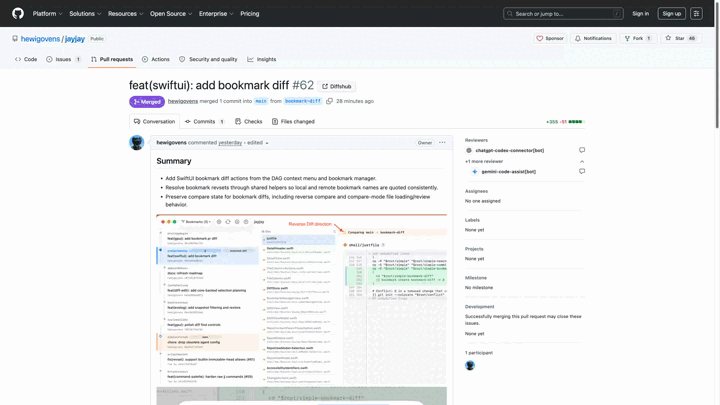

# Open in Diffshub

A small Chrome / Edge extension (MV3) that adds an **Open in Diffshub** button to every GitHub pull request page. Click it (or the toolbar icon) to open the same PR on [diffshub.com](https://diffshub.com).

[](https://chromewebstore.google.com/detail/open-in-diffshub/pgmcdokikomeilbkobgfmlihmilingpl)
[](https://github.com/hewigovens/open-in-diffs/actions/workflows/ci.yml)

> **Not affiliated with diffshub.com.** This is an unofficial, community-built extension that simply links to diffshub.com. It is not made, endorsed, or maintained by Diffshub.

## Demo



_Higher-quality recording: [docs/demo.webm](docs/demo.webm)._

## Features

- One click opens any GitHub pull request on diffshub.com — same path, just the hostname swapped.
- Available on every PR sub-page: Conversation, Files changed, Checks, Commits.
- Works without a GitHub sign-in.
- Toolbar-icon shortcut — click it from any GitHub PR tab and the diffshub equivalent opens in a new tab (non-PR tabs go to the diffshub home).

## How it works

- The content script anchors on the PR title `<h1>` (identified by the `#<number>` in the URL), so it stays stable across GitHub's classic and new UIs.
- The toolbar action handler does the same hostname swap from a tiny background service worker.
- Vanilla JS — no bundler, no runtime dependencies.

## Privacy

The extension only runs on GitHub pull request pages and uses the `activeTab` permission. It reads the current tab's URL to build the diffshub link and opens a new tab — nothing is collected, stored, or sent anywhere.

## Install

[**Install from the Chrome Web Store**](https://chromewebstore.google.com/detail/open-in-diffshub/pgmcdokikomeilbkobgfmlihmilingpl) — works in both Chrome and Edge.

### Unpacked (for development)

1. Open `chrome://extensions` (or `edge://extensions`).
2. Toggle **Developer mode** on.
3. Click **Load unpacked** and select this repo's `src/` folder.

## Develop

For local development you don't need a build — just **Load unpacked** from `src/` (above).

To produce the signed `.crx` the store accepts, you need `jq`, ImageMagick (`magick` or `convert`), a Chromium-based browser, and an RSA signing key:

```sh
npm run gen-icons              # rasterize src/icons/icon.svg → 16/48/128 PNGs
npm run pack -- path/key.pem   # sign src/ → dist/open-in-diffs-<version>.crx
npm run clean                  # rm -rf dist
```

`src/manifest.json` is the single source of truth for the version.

## Releasing

Releases are automated. Tag a version and push:

```sh
git tag v1.0.1 && git push --tags
```

The [release workflow](.github/workflows/release.yml) signs a `.crx`, attaches it to a GitHub Release, and publishes to the Chrome Web Store. Publishing uses [Verified CRX Uploads](https://developer.chrome.com/blog/verified-uploads-cws): the package is signed with a private key held only in the `CWS_SIGNING_KEY` secret, and the step is gated behind a protected environment that requires manual approval.

## Layout

```
src/                              # the extension (Load Unpacked points here)
├── manifest.json                 # MV3, single source of truth for the version
├── content.js                    # injects the Diffshub button into PR pages
├── background.js                 # toolbar-icon click handler
└── icons/
    ├── icon.svg                  # brand mark, committed
    └── icon{16,48,128}.png       # gitignored, generated from icon.svg
scripts/
├── gen-icons.sh                  # rasterize the SVG into PNGs (ImageMagick)
├── pack-crx.sh                   # sign src/ into a .crx (Chromium)
└── publish-cws.sh                # upload + publish to the Chrome Web Store
.github/workflows/                # ci.yml (build) and release.yml (sign + publish)
docs/                             # demo.gif, demo.webm, store screenshot
```
